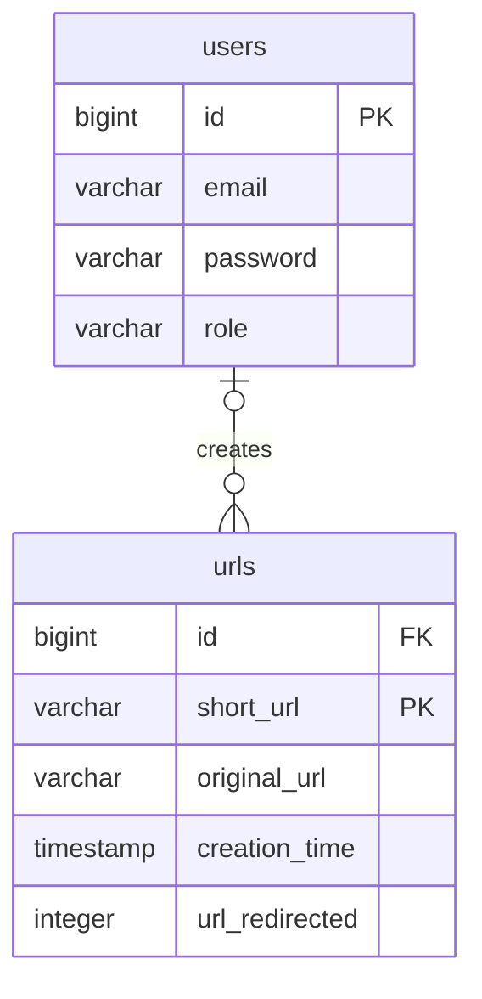

# URL Shortener API built with Fastify

## Install Dependencies

Use [**npm**](https://docs.npmjs.com/downloading-and-installing-node-js-and-npm#using-a-package-manager-to-install-nodejs-and-npm) as the package manager. Run the following command to install the dependencies:

```
npm install
```

## Database Setup

Run the SQL commands in [migration.sql](./src/database/migration.sql) file to create the database tables.

To seed sample data, run the files in [seeds](./src/database/seeds) directory like this:

```
npx ts-node src/database/seeds/<file>.ts
```

## Available Scripts

In the project directory, you can run:

```
npm dev
```

To start the app in dev mode.

```
npm start
```

For production mode

```
npm test
```

Run the test cases.

## Entity Relationship Diagram (ERD)


